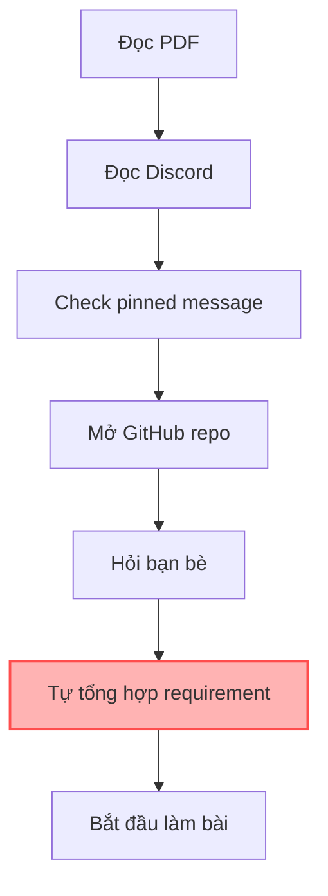
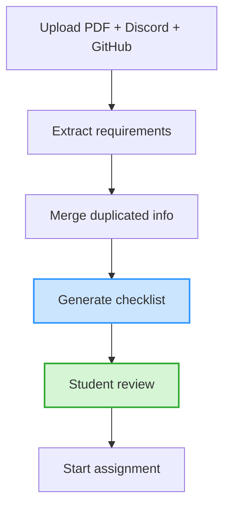
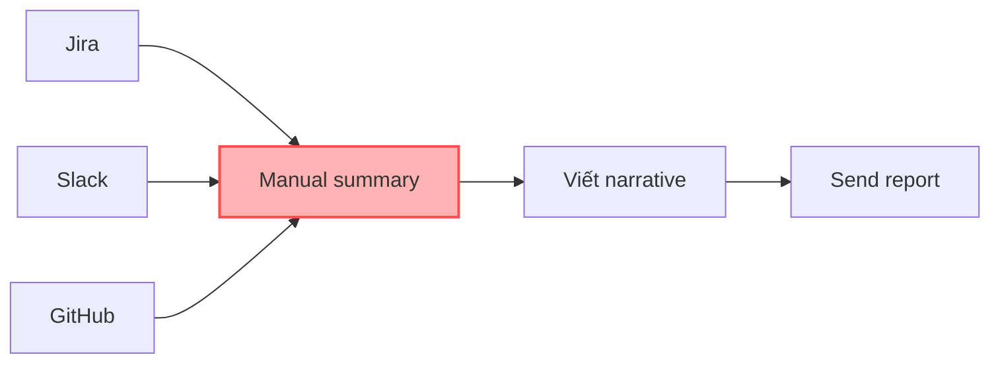
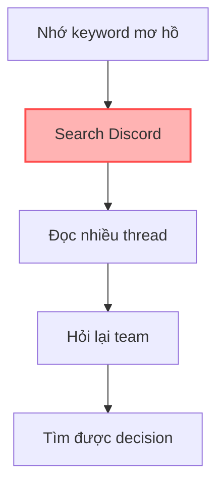

# 01 — Individual Problem Scan

## Scan rộng

| #  | Lăng kính          | Problem quan sát được                                                               | Ai đang đau?       | Dấu hiệu thật                |
| -- | ------------------ | ----------------------------------------------------------------------------------- | ------------------ | ---------------------------- |
| 1  | Lặp lại            | Sinh viên phải đọc nhiều source (Discord, PDF, GitHub) để biết chính xác cần nộp gì | Sinh viên học tech | Hỏi lại nhiều trước deadline |
| 2  | Lặp lại            | Team member mới setup Git/GitHub workflow rất lâu                                   | Member mới         | Onboarding 30-60 phút        |
| 3  | Tốn thời gian      | Viết weekly update từ GitHub + Discord + task board                                 | Team lead          | 45-60 phút/tuần              |
| 4  | Tốn thời gian      | Search decision cũ trong Discord thread rất khó                                     | Team project       | 10-15 phút/lần tìm           |
| 5  | AI có thể tốt hơn  | Requirement/task bị rải rác nhiều nơi                                               | Sinh viên/team     | Miss format submit           |
| 6  | AI có thể tốt hơn  | Review PRD dài trước khi comment mất nhiều thời gian                                | PM reviewer        | 30-45 phút/document          |
| 7  | Pain từ người khác | Designer phải hỏi lại vì spec từ PM chưa rõ                                         | Designer, PM       | 2-3 lần hỏi/spec             |
| 8  | Pain từ người khác | Meeting xong không ai nhớ action items                                              | Team member        | Task bị quên                 |
| 9  | Tốn thời gian      | Tìm function/file liên quan trong codebase lớn                                      | Developer          | Search lâu                   |
| 10 | Lặp lại            | Viết meeting notes sau mỗi buổi họp                                                 | PM/team lead       | 20-30 phút/buổi              |

---

# Top 3 Problems

| Rank | Problem                           | Vì sao chọn                          | Điều còn chưa chắc                           |
| ---- | --------------------------------- | ------------------------------------ | -------------------------------------------- |
| 1    | Multi-source assignment confusion | Pain thật, workflow rõ, dễ đo metric | AI extract requirement có đủ chính xác không |
| 2    | Weekly report generation          | Có before/after rõ, AI fit tốt       | Data source có đồng nhất không               |
| 3    | Discord decision search           | Team nào cũng gặp                    | Search quality khó đo                        |

---

# Problem Card #1 — Multi-source Assignment Confusion

## Problem 1 câu

Sinh viên phải đọc nhiều nguồn rời rạc (Discord, Notion, PDF, GitHub) để biết chính xác cần làm gì trước deadline.

---

## Actor

* Sinh viên học tech
* Team member mới

---

## Current Workflow

---

## Bottleneck

* Requirement nằm rải rác
* Dễ miss update trong Discord
* Mất nhiều thời gian verify requirement

---

## Future Workflow

---

## Success Metric

| Metric               | Current      | Expected     |
| -------------------- | ------------ | ------------ |
| Time hiểu assignment | 45 phút      | dưới 10 phút |
| Số lần hỏi lại       | 5 lần/team   | dưới 1 lần   |
| Miss requirement     | Thỉnh thoảng | hiếm         |

---

## Quick Gut

* [ ] No AI
* [ ] Rule
* [x] Workflow
* [ ] Agent

---

# Problem Card #2 — Weekly Report Generation

## Problem 1 câu

PM/team lead mất nhiều thời gian tổng hợp progress từ Jira, Slack và GitHub để viết weekly report.

## Current Workflow

## Quick Gut

* [ ] Rule
* [x] Workflow
* [ ] Agent

---

# Problem Card #3 — Discord Decision Search

## Problem 1 câu

Team member khó tìm lại decision cũ trong Discord/thread dài khi tiếp tục công việc.

## Current Workflow

## Quick Gut

* [ ] Rule
* [x] Workflow
* [ ] Agent
