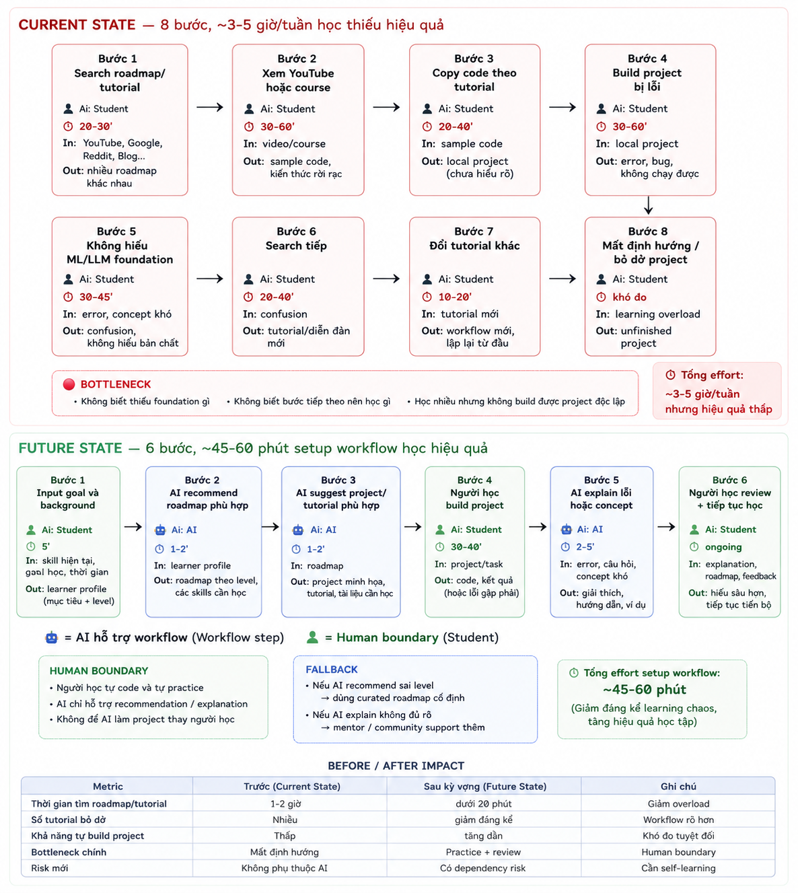

# 02 — Group Problem Statement

## Group convergence

| Cluster                                        | Candidate examples                                                                                                    | Pattern chung                                                            |
| ---------------------------------------------- | --------------------------------------------------------------------------------------------------------------------- | ------------------------------------------------------------------------ |
| AI learning roadmap / tutorial overload        | Học AI quá nhanh nhưng không hiểu nền tảng ML/LLM, xem tutorial rồi copy code, không biết nên học Data/ML/GenAI trước | Người mới học AI bị overload thông tin và thiếu workflow học tập rõ ràng |
| Multi-source Information Overload | Requirement/task bị rải rác nhiều nơi, quá nhiều tài liệu không biết đọc gì trước, phải check Discord/outlook/zalo/teams/ liên tục để không miss thông tin | Thông tin học tập và assignment bị phân tán qua nhiều kênh, khiến người học mất thời gian theo dõi và dễ bỏ sót update quan trọng |
| Dev onboarding / setup friction                | Setup Git/GitHub workflow lâu, cài môi trường AI/project khó                                                          | Người mới mất nhiều thời gian onboarding trước khi bắt đầu build project |

## Shortlist và score

| Candidate                         | Actor rõ | Workflow rõ | Pain có evidence | Impact đo được | Làm trong lab | So sánh R/W/A được | Nhóm hiểu domain | Tổng |
| --------------------------------- | -------: | ----------: | ---------------: | -------------: | ------------: | -----------------: | ---------------: | ---: |
| AI Learning Roadmap Overload      |        5 |           5 |                5 |              4 |             5 |                  5 |                5 |   34 |
| Multi-source Assignment Confusion |        4 |           4 |                4 |              5 |             5 |                  4 |                4 |   30 |
| Dev Environment Setup Friction    |        4 |           4 |                5 |              4 |             4 |                  3 |                4 |   28 |

Nhóm chọn: **AI Learning Roadmap Overload**.

Vì sao chọn:

* Pain phổ biến với hầu hết sinh viên mới học AI.
* Workflow học tập rất rõ và dễ visualize before/after.
* Có thể validate nhanh với sinh viên cùng lớp hoặc cộng đồng học AI.
* Có thể research nhiều existing tools/pattern.
* AI phù hợp vì có thể đóng vai trò hỗ trợ học tập: 
    - gợi ý nên học gì tiếp theo,
    - giải thích kiến thức khó,
    - hướng dẫn build project theo từng bước.

Vì sao không chọn các bài khác:

* Multi-source Information Overload:

  * Workflow rõ nhưng gần với information management hơn learning guidance.
  * Dễ trượt sang bài toán summarize/search system khá lớn.
* Technical Setup & Onboarding:

  * Pain thật nhưng nhiều phần có thể giải bằng documentation/template.
  * AI chưa chắc tạo khác biệt lớn hơn process chuẩn hóa.

## Quick validation

Nhóm hỏi nhanh sinh viên học AI và member trong community tech.

| Nguồn               | Số người | Tín hiệu xác nhận                                             | Tín hiệu phản bác                                       | Nhóm sửa problem thế nào                                                                |
| ------------------- | -------: | ------------------------------------------------------------- | ------------------------------------------------------- | --------------------------------------------------------------------------------------- |
| Quick interview     |        3 | 3/3 từng học tutorial nhưng không build project được một mình | 1 người nói chỉ cần chăm practice nhiều hơn             | Thu hẹp problem: không phải “học AI”, mà là “thiếu workflow học có context và feedback” |
| Mini poll trong lớp |        5 | 4/5 từng bị overload roadmap/tutorial                         | Một số người thích tự explore không cần roadmap cố định | Thêm boundary: AI chỉ gợi ý và explain, không thay người học quyết định                 |

### Insight sau validation

```text id="x6ke2r"
Pain không nằm ở việc “thiếu tài liệu”.

Pain nằm ở việc:
- có quá nhiều roadmap khác nhau,
- sinh viên học nhanh theo trend,
- nhưng không hiểu nền tảng hoặc không biết bước tiếp theo nên học gì.
```

## Research giải pháp

Nhóm tìm các hướng đã có sẵn thay vì giả định phải build agent hoàn chỉnh từ đầu.

| Nguồn / tool / case           | Link                                       | Họ giải quyết phần nào?    | Điểm mạnh                          | Khoảng trống / rủi ro                 | Bài học cho nhóm                                   |
| ----------------------------- | ------------------------------------------ | -------------------------- | ---------------------------------- | ------------------------------------- | -------------------------------------------------- |
| Coursera Guided Learning      | https://www.coursera.org                   | Roadmap học có structure   | Beginner-friendly                  | Ít cá nhân hóa theo background        | Structure quan trọng hơn việc có quá nhiều content |
| DeepLearning.AI Short Courses | https://www.deeplearning.ai/short-courses/ | Học AI theo project nhỏ    | Nội dung practical, cập nhật nhanh | Người học vẫn dễ “xem xong quên”      | Project-based workflow giúp giữ context            |
| Khanmigo AI Tutor             | https://www.khanacademy.org/khan-labs      | AI tutor hỗ trợ giải thích | Có conversational guidance         | Chưa focus workflow học AI/ML thực tế | AI phù hợp vai trò mentor/explainer hơn “làm hộ”   |
| GitHub Copilot / ChatGPT      | https://github.com/features/copilot        | Hỗ trợ code/explain        | Giúp debug và explain nhanh        | Dễ làm người học phụ thuộc copy code  | Cần boundary để tránh tutorial hell mới            |

### Research takeaway

```text id="6s7kh9"
Không nên build một “AI mentor toàn năng”.

Workflow hợp lý hơn là:
- recommend roadmap theo level,
- giải thích concept,
- gợi ý bước tiếp theo,
- nhưng người học vẫn phải tự build và tự verify hiểu biết.
```

## Workflow before/after


Nội dung workflow:



## Problem Statement v0

| Field              |ß Nội dung                                                                                                      |
| ------------------ | ------------------------------------------------------------------------------------------------------------- |
| **Actor**          | Sinh viên mới học AI/ML/GenAI chưa có workflow học tập rõ ràng.                                               |
| **Workflow**       | Search roadmap → xem tutorial → copy code → gặp lỗi/không hiểu → search tiếp → đổi tutorial → mất định hướng. |
| **Bottleneck**     | Người học không biết mình thiếu nền tảng gì hoặc nên học bước tiếp theo như thế nào.                          |
| **Impact**         | Mất nhiều thời gian học lan man; khó build project độc lập; dễ bỏ dở việc học AI.                             |
| **Success Metric** | Giảm thời gian tìm roadmap/tutorial; tăng khả năng tự build project nhỏ; giảm số tutorial bỏ dở.              |
| **Boundary**       | AI không làm project thay người học; không tự generate roadmap hoàn toàn không có human review.               |

## Rule / Workflow / Agent

| Mức          | Phương án                                                                                | Khi nào đủ                                         | Rủi ro                                     | Chọn?                  |
| ------------ | ---------------------------------------------------------------------------------------- | -------------------------------------------------- | ------------------------------------------ | ---------------------- |
| **Rule**     | Curated roadmap cố định, learning checklist                                              | Đủ nếu user profile giống nhau                     | Không cá nhân hóa theo background/mục tiêu | Không chọn làm toàn bộ |
| **Workflow** | Input goal/background → AI suggest roadmap/project → AI explain concept → learner review | Hợp vì workflow học khá tuyến tính                 | AI recommend sai level hoặc tạo dependency | Chọn                   |
| **Agent**    | Agent tự theo dõi progress, đổi roadmap, assign task                                     | Chỉ cần nếu workflow học quá dynamic và multi-tool | Scope quá rộng, khó validate trong lab     | Chưa chọn              |

Mức chọn:

```text
Workflow.
```

Vì sao:

* Learning workflow có các bước khá rõ.
* AI phù hợp ở bước recommendation và explanation.
* Người học vẫn phải tự practice và review.
* Chưa cần agent tự lập kế hoạch động.

## Problem Statement v1

| Field                            | Nội dung                                                                                              |
| -------------------------------- | ----------------------------------------------------------------------------------------------------- |
| **Actor**                        | Sinh viên mới học AI/ML/GenAI bị overload bởi tutorial và roadmap phân tán.                           |
| **Workflow**                     | Search roadmap → xem tutorial → copy code → gặp lỗi → đổi tutorial → mất định hướng.                  |
| **Bottleneck**                   | Không biết thiếu nền tảng gì và không biết nên học bước tiếp theo như thế nào.                        |
| **Impact**                       | Người học mất nhiều thời gian học lan man và khó build project độc lập.                               |
| **Success Metric**               | Giảm thời gian tìm roadmap/tutorial xuống dưới 20 phút; tăng khả năng hoàn thành project nhỏ độc lập. |
| **Boundary**                     | AI không làm project thay; không tự quyết định toàn bộ roadmap học tập.                               |
| **AI intervention point**        | Sau bước người học nhập goal/background, trước bước chọn tutorial/project tiếp theo.                  |
| **Mức chọn**                     | Workflow: AI recommend roadmap/project + explain concept, người học review và practice.               |
| **Rủi ro & người thật kiểm tra** | Risk: phụ thuộc AI, roadmap sai level, shallow learning. Người review cuối: chính người học/mentor.   |

## Final decision

Decision:

```text
Go với scope nhỏ.
```

Pilot nhỏ nhất:

* Cho 3-5 sinh viên nhập goal/background.
* AI generate roadmap + suggest project/tutorial.
* Theo dõi:

  * thời gian chọn tài liệu,
  * số tutorial bỏ dở,
  * khả năng hoàn thành mini project.

Exit / rollback:

* Nếu người học vẫn copy tutorial mà không hiểu workflow → hạ scope xuống curated roadmap + checklist.
* Nếu AI recommend sai level quá nhiều → dùng hybrid: roadmap cố định + AI explain.

Decision rationale:

* Problem rõ, phổ biến và dễ validate.
* Workflow before/after rõ.
* Có non-AI alternative.
* AI chỉ hỗ trợ một số bước thay vì ôm toàn bộ việc học.
* Human review và self-practice vẫn là trung tâm.
